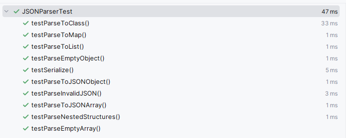

# Custom JSON Parser

## Описание
Данный проект реализует пользовательский JSON-парсер на Java. Он предоставляет функциональность для разбора JSON-строк в объекты Java, преобразования объектов Java в JSON-строки и выполнения различных операций с JSON.

## Особенности
- Парсинг JSON-строк в объекты Java (JSONObject и JSONArray)
- Преобразование JSON в Map<String, Object> и List<Object>
- Парсинг JSON в указанные Java-классы
- Сериализация объектов Java в JSON-строки
- Обработка вложенных структур
- Обнаружение и генерация исключений для некорректного JSON

## Основные Компоненты

### JSONParser
Основной класс, отвечающий за парсинг JSON-строк. Включает методы для:
- Парсинга в JSONObject и JSONArray
- Преобразования в Map и List
- Парсинга в указанные классы

### JSONObject
Представляет собой JSON-объект. Реализует интерфейс Map для удобной работы с данными.

### JSONArray
Представляет собой JSON-массив. Реализует интерфейс List для удобного доступа к элементам.

### JSONException
Пользовательский класс исключений для ошибок, связанных с JSON.

### JSONSerializer
Отвечает за сериализацию объектов Java в JSON-строки.

## Примеры использования

1. Парсинг JSON в JSONObject:
   `JSONObject obj = JSONParser.parseToJSONObject(jsonString);`

2. Парсинг JSON в Map:
   `Map<String, Object> map = JSONParser.parseToMap(jsonString);`

3. Парсинг JSON в указанный класс:
   `MyClass instance = JSONParser.parseToClass(jsonString, MyClass.class);`

4. Сериализация объекта в JSON:
   `String json = JSONSerializer.serialize(myObject);`

Больше примеров можно найти в файле Main.java. 

<details>
<summary>Нажмите, чтобы увидеть вывод Main.java</summary>

```
1. Parsing JSON to JSONObject:
Parsed JSONObject: {"address":{"zipcode":"10001","street":"123 Main St"},"city":"New York","name":"John Doe","grades":[85,90,78],"age":30,"isStudent":false}
Accessing 'name': John Doe
Accessing 'age': 30

2. Parsing JSON to Map<String, Object>:
Parsed Map: {name=John Doe, address={"zipcode":"10001","street":"123 Main St"}, grades=[85,90,78], city=New York, age=30, isStudent=false}
Accessing 'name': John Doe
Accessing 'age': 30

3. Parsing JSON to JSONArray:
Parsed JSONArray: [{"name":"Alice","id":1},{"name":"Bob","id":2},{"name":"Charlie","id":3}]
First element: {"name":"Alice","id":1}
Array size: 3

4. Parsing JSON to List<Object>:
Parsed List: [{"name":"Alice","id":1}, {"name":"Bob","id":2}, {"name":"Charlie","id":3}]
First element: {"name":"Alice","id":1}
List size: 3

5. Accessing nested objects and arrays:
Street: 123 Main St
Zipcode: 10001
Grades: [85,90,78]
First grade: 85
Is student? false
Age (as Long): 30

6. Parsing JSON to a specified class:
Parsed Person object:
Name: John Doe
Age: 30
City: New York
Is student: false
Grades: [85, 90, 78]
Address: Address{street='123 Main St', zipcode='10001'}

7. Converting Java object to JSON string:
Serialized Person object:
{"name":"Jane Doe","age":28,"city":"San Francisco","isStudent":true,"grades":[95,88,92],"address":{"street":"456 Elm St","zipcode":"94102"}}

Process finished with exit code 0
```

</details>

## Структура Проекта
```
src/
├── main/
│   └── java/
│       └── com/
│           └── jsonparser/
│               ├── JSONParser.java
│               ├── JSONObject.java
│               ├── JSONArray.java
│               ├── JSONException.java
│               └── JSONSerializer.java
└── test/
└── java/
└── com/
└── jsonparser/
└── JSONParserTest.java
```

## Тестирование
Проект включает в себя набор тестов (JSONParserTest.java), покрывающих различные сценарии, включая:
- Парсинг корректных JSON-объектов и массивов
- Обработку вложенных структур
- Обнаружение некорректного JSON (например, запятые на конце)
- Сериализацию объектов Java в JSON

Результаты тестирования:



## Ограничения
- Не поддерживаются все возможные escape-последовательности JSON
- Могут быть ограничения при работе с очень большими JSON-строками из-за рекурсивного парсинга